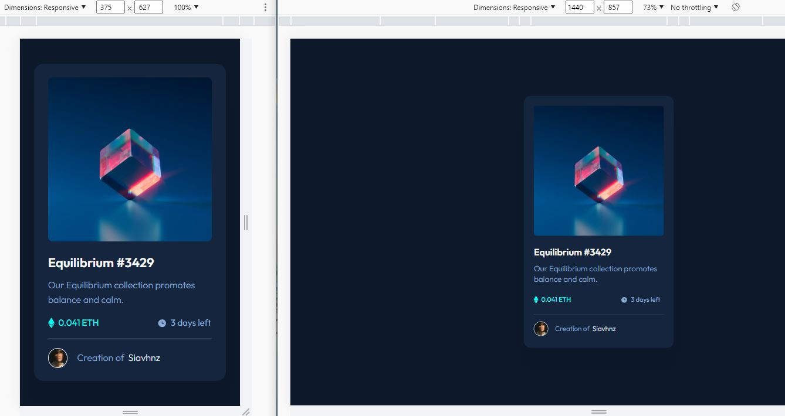

# Frontend Mentor - NFT preview card component solution

This is a solution to the [NFT preview card component challenge on Frontend Mentor](https://www.frontendmentor.io/challenges/nft-preview-card-component-SbdUL_w0U).
## Table of contents

- [Overview](#overview)
  - [The challenge](#the-challenge)
  - [Screenshot](#screenshot)
  - [Links](#links)
- [My process](#my-process)
  - [Workflow](#workflow)
  - [Built with](#built-with)
  - [What I learned](#what-i-learned)
  - [Continued development](#continued-development)
  - [Useful resources](#useful-resources)
- [Author](#author)
- [Acknowledgments](#acknowledgments)

## Overview

### The challenge

Users should be able to:

- View the optimal layout depending on their device's screen size
- See hover states for interactive elements

### Screenshot

### Links

- Solution: [frontendmentor.io](https://www.frontendmentor.io/solutions/nft-preview-card-component--YNNsrFAYE)
- Live Site: [github.io](https://siavhnz.github.io/frontendmentor/2.nft-preview-with-tailwindcss/index.html)

## My process

### Workflow
 - Set up the project
 - Create the skeleton of the HTML file
 - mobile-first design
 - Desktop design
 - Compelete README.md file
 - Push solution on github.com
 - Publish solution on github.io and frontendmentor.io

### Built with

- Semantic HTML5 markup
  - main, article, figure, footer, address
- Tailwindcss

### What I learned

This is a Tailwindcss solution version for the [NFT preview card component challenge](https://www.frontendmentor.io/challenges/nft-preview-card-component-SbdUL_w0U)

I learned how to:

 - [Customize default font](https://tailwindcss.com/docs/font-family#customizing-the-default-font) to [Preflight](https://tailwindcss.com/docs/preflight)

 - [Customize defaut theme](https://tailwindcss.com/docs/background-color#customizing-your-theme)

> Built on top of [modern-normalize](https://github.com/sindresorhus/modern-normalize), Preflight is a set of base styles for Tailwind projects that are designed to smooth over cross-browser inconsistencies and make it easier for you to work within the constraints of your design system.

### Continued development

I want to read more about pure CSS, understand its various concepts, and also; work with Tailwindcss on further challenges.

### Useful resources

- [Tailwindcss installation](https://tailwindcss.com/docs/installation)

- [Preflight](https://tailwindcss.com/docs/preflight) - help to smooth over cross-browser inconsistencies

- [Customize default font in tailwindcss](https://tailwindcss.com/docs/font-family#customizing-the-default-font)

- [Customize defaut theme in tailwindcss](https://tailwindcss.com/docs/background-color#customizing-your-theme)

## Author

Frontend Mentor - [@siavhnz](https://www.frontendmentor.io/profile/siavhnz)

## Acknowledgments

Thanks to:

[Frontendmentor.io](https://www.frontendmentor.io/challenges) - for their Excitement challenges  

[Perfect Pixel](https://chrome.google.com/webstore/detail/perfectpixel-by-welldonec/dkaagdgjmgdmbnecmcefdhjekcoceebi?hl=en) - for such a great extension

[Tailwindcss](https://tailwindcss.com/) - for making CSS easy

